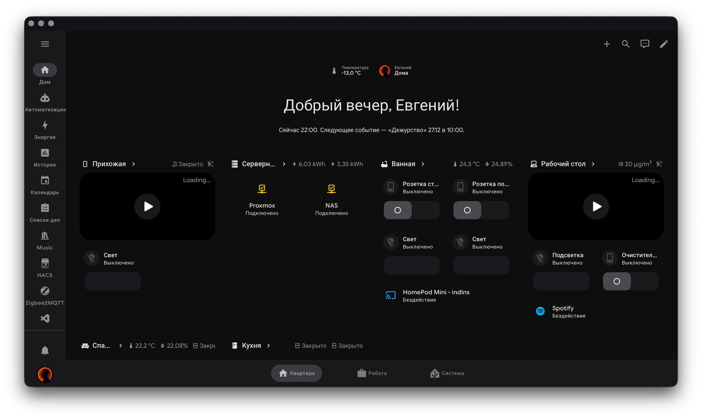

# Home Assistant
Пример конфигурации Home Assistant.

# Preview
|  |
|:--:|

# Integrations
## HACS
- Yandex Intents
- Yandex Station
- Yandex Smarthome
- Yandex Dialogs
- Yandex Pogoda
- Adaptive Lights
- WebRTC Camera
- Xiaomi Home
- OpenID

## System
- Withings
- Spotify
- Caldav
- Synology DSM
- Ollama
- AppleTV
- HomeKit
- GitHub
- LinkPlay
- MQTT
- Ping
- Plex
- System Monitor
- SQL
- Telegram
- Xbox
- Todo List
- Backup

# Addons
- Studio Code Server
- Terminal & SSH
- Zigbee2MQTT
- Mosquitto Broker
- MariaDB
- Go2rtc
- Scrypted
- Music Assistant

# Themes
- Material You with Utilities

# Other
- 